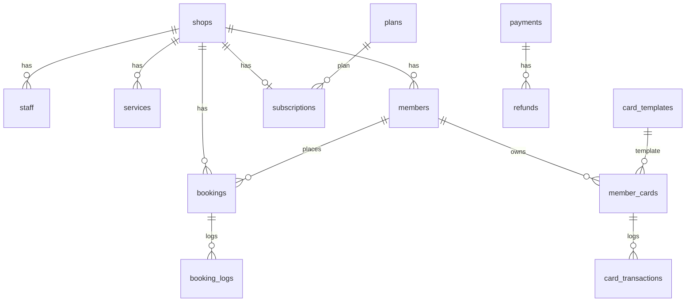

# Data and cache

[中文](./DATA.md) | **English**

This document describes the **MySQL schema** and **Redis key conventions**. Source of truth:

- Models: `apps/api/prisma/schema.prisma`
- Incremental SQL: `apps/api/prisma/migrations/*/migration.sql`

## MySQL

### Connection and setup

| Step | Command / config |
| --- | --- |
| Connection | `DATABASE_URL` in root `.env` (see `.env.example`) |
| Local DB | After `pnpm docker:up`: database `merchant_booking`, charset `utf8mb4` |
| Apply migrations | `pnpm db:migrate` (`prisma migrate dev` in development) |
| Generate client | `pnpm db:generate` |
| Demo data | **Recommended** `pnpm db:seed` (`apps/api/prisma/seed.ts`) |
| Optional SQL | `apps/api/prisma/seed-data.sql` (raw SQL demo data) |

On production servers use `prisma migrate deploy`, not `migrate dev`. See [DEPLOY.en.md](./DEPLOY.en.md).

### Migration history (chronological)

| Folder | Summary |
| --- | --- |
| `20260825142600_init` | Core tables (shops, staff, bookings, members, cards, payments, verify, …) |
| `20260829150000_shop_mini_config` | `shops.mini_config` |
| `20260829160000_service_tags_highlights` | Service tags and highlights |
| `20260830130000_service_deposit_ratio` | Deposit ratio |
| `20260830131000_service_deposit_default` | Default deposit |
| `20260830140000_service_deposit_type` | Deposit type (ratio / fixed) |
| `20260830150000_shop_wx_config` | `shops.wx_config` |
| `20260830160000_card_template_description` | Card template description |
| `20260830170000_shop_card_types` | `shops.card_types` |
| `20260830180000_shop_card_types_seed` | Card type seed data |
| `20260831090000_saas_billing` | `plans`, `subscriptions`, `shops.plan_id`, … |

Concatenate each `migration.sql` in order for full DDL. Day-to-day schema changes: edit `schema.prisma`, then add a new migration.

### Tables

| Table | Description |
| --- | --- |
| `shops` | Shops; JSON: `business_hours`, `mini_config`, `card_types`, `wx_config` |
| `staff` | Staff / technicians |
| `staff_schedules` | Schedules (weekly + `exception_date`) |
| `services` | Services, deposit rules, `staff_ids` |
| `members` | Mini program members; unique `(shop_id, openid)` |
| `bookings` | Bookings |
| `booking_logs` | Booking status history |
| `card_templates` | Membership card templates |
| `member_cards` | Issued cards |
| `card_transactions` | Balance / times ledger |
| `payments` | Payments (deposit, card purchase, …) |
| `refunds` | Refunds |
| `verify_records` | Verification records (persistent) |
| `subscribe_logs` | Subscribe message send log |
| `admin_users` | Shop admin accounts |
| `operation_logs` | Admin audit log |
| `time_slot_locks` | Slot lock table (**created, not used in app logic**; concurrency uses Redis + `bookings`) |
| `plans` | SaaS plans |
| `subscriptions` | Shop subscription and expiry |
| `platform_users` | Platform operator accounts |

### Status enums

Defined in `apps/api/src/common/constants/business.ts`.

**Booking `bookings.status`**

| Value | Meaning |
| --- | --- |
| 0 | Pending payment `PENDING_PAY` |
| 1 | Booked `BOOKED` |
| 2 | Arrived `ARRIVED` |
| 3 | Completed `COMPLETED` |
| 4 | Cancelled `CANCELLED` |
| 5 | No-show `NO_SHOW` |

**Card type `member_cards.type` / `card_templates.type`**

| Value | Meaning |
| --- | --- |
| 1 | Stored value |
| 2 | Times card |
| 3 | Period card (e.g. monthly) |

**Payment `payments.status`**

| Value | Meaning |
| --- | --- |
| 0 | Pending |
| 1 | Paid |
| 2 | Refunded |

**Subscription `subscriptions.status`**

| Value | Meaning |
| --- | --- |
| 1 | Trial |
| 2 | Active |
| 3 | Expired |
| 4 | Frozen |

### ER diagram (simplified)

## Redis

### Configuration

- Env: `REDIS_URL` (e.g. `redis://localhost:6379`)
- Implementation: `apps/api/src/redis/redis.module.ts` (`ioredis`)
- **Missing or unreachable Redis**: in-process `Map` fallback (single-process dev only). Use Redis in production / multi-instance.

**BullMQ is not used**; the dependency is reserved. Cron jobs use `@nestjs/schedule` in the **API process** (`apps/api/src/jobs/jobs.service.ts`).

### Key conventions

All keys are **strings**; no Hash/List/Set business schema.

| Key pattern | Value | TTL | Notes |
| --- | --- | --- | --- |
| `verify:{code}` | `{memberId}:{cardId}` | 60s | Customer verify code cache; deleted after use. `verify.service.ts` |
| `lock:booking:{shopId}:{staffId}:{bookDate}:{timeSlot}` | `1` | 10s (`SET NX EX`) | Distributed lock for create/reschedule. Logical key `booking:...`, stored with `lock:` prefix. `booking.service.ts` |

Lock failure → `LOCK_BUSY`. Lock released in `withLock` `finally`.

### MySQL vs Redis

| Scenario | MySQL | Redis |
| --- | --- | --- |
| Slot availability | `bookings` status and uniqueness | Short mutex against double booking |
| Verify code display | `verify_records` persistence | 60s cache for scan validation |
| Unpaid booking timeout | `bookings` update | None (cron scans DB) |
| Reminders, card expiry, subscription expiry | Business tables | None (cron scans DB) |

## Scheduled jobs (not Redis)

Started with `pnpm dev:api` / production API (`JobsModule`):

| Cron | Job |
| --- | --- |
| Every minute | Close expired unpaid bookings |
| Hourly | Booking reminder messages; expire shop subscriptions |
| Daily midnight | Mark expired member cards |

Root `pnpm dev:worker` points to a separate worker entry; **no `worker` entry file in this repo yet** — run jobs in the API process.
