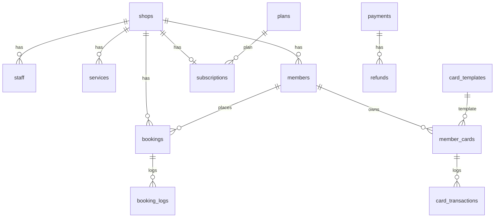

# 数据与缓存说明

**中文** | [English](./DATA.en.md)

本文说明 **MySQL 表结构** 与 **Redis 使用约定**。权威定义以代码为准：

- 模型：`apps/api/prisma/schema.prisma`
- 增量 SQL：`apps/api/prisma/migrations/*/migration.sql`

## MySQL

### 连接与初始化

| 步骤 | 命令 / 配置 |
| --- | --- |
| 连接串 | 根目录 `.env` 中 `DATABASE_URL`（示例见 `.env.example`） |
| 本地库 | `pnpm docker:up` 后默认库名 `merchant_booking`，字符集 `utf8mb4` |
| 应用迁移 | `pnpm db:migrate`（开发环境执行 `prisma migrate dev`） |
| 生成 Client | `pnpm db:generate` |
| 演示数据 | **推荐** `pnpm db:seed`（`apps/api/prisma/seed.ts`） |
| 可选 SQL | `apps/api/prisma/seed-data.sql`（纯 SQL 演示数据，可与 seed 二选一了解结构） |

生产环境在部署机执行迁移（勿用 `migrate dev`），参见 [DEPLOY.md](./DEPLOY.md)。

### 迁移版本（按时间顺序）

| 目录 | 主要内容 |
| --- | --- |
| `20260825142600_init` | 核心业务表（店铺、技师、预约、会员、卡、支付、核销等） |
| `20260829150000_shop_mini_config` | 店铺小程序展示配置 `shops.mini_config` |
| `20260829160000_service_tags_highlights` | 服务项目标签、亮点 |
| `20260830130000_service_deposit_ratio` | 订金比例 |
| `20260830131000_service_deposit_default` | 订金默认值 |
| `20260830140000_service_deposit_type` | 订金类型（比例 / 固定） |
| `20260830150000_shop_wx_config` | 店铺微信与支付配置 `shops.wx_config` |
| `20260830160000_card_template_description` | 卡模板描述 |
| `20260830170000_shop_card_types` | 店铺卡类型展示 `shops.card_types` |
| `20260830180000_shop_card_types_seed` | 卡类型种子数据 |
| `20260831090000_saas_billing` | 套餐 `plans`、订阅 `subscriptions`、店铺 `plan_id` 等 |

如需完整 DDL，将上述目录下各 `migration.sql` 按顺序拼接即可得到当前库结构；日常改表应改 `schema.prisma` 再生成新 migration。

### 表清单

| 表名 | 说明 |
| --- | --- |
| `shops` | 店铺；含 `business_hours`、`mini_config`、`card_types`、`wx_config`（JSON） |
| `staff` | 技师 / 店员 |
| `staff_schedules` | 排班（周模板 + `exception_date` 例外日） |
| `services` | 服务项目、订金规则、绑定技师 `staff_ids` |
| `members` | 小程序会员（按 `shop_id` + `openid` 唯一） |
| `bookings` | 预约单 |
| `booking_logs` | 预约状态变更流水 |
| `card_templates` | 会员卡模板 |
| `member_cards` | 用户持卡实例 |
| `card_transactions` | 卡余额 / 次数变动流水 |
| `payments` | 支付单（预约订金、购卡等） |
| `refunds` | 退款单 |
| `verify_records` | 核销记录（持久化） |
| `subscribe_logs` | 订阅消息发送记录 |
| `admin_users` | 店铺后台账号 |
| `operation_logs` | 后台操作审计 |
| `time_slot_locks` | 时段锁表（**已建表，当前业务逻辑未使用**；并发靠 Redis 锁 + `bookings` 校验） |
| `plans` | SaaS 套餐 |
| `subscriptions` | 店铺订阅与到期 |
| `platform_users` | 平台运营账号 |

### 常用状态枚举（业务常量）

定义见 `apps/api/src/common/constants/business.ts`。

**预约 `bookings.status`**

| 值 | 含义 |
| --- | --- |
| 0 | 待支付 `PENDING_PAY` |
| 1 | 已预约 `BOOKED` |
| 2 | 已到店 `ARRIVED` |
| 3 | 已完成 `COMPLETED` |
| 4 | 已取消 `CANCELLED` |
| 5 | 爽约 `NO_SHOW` |

**会员卡类型 `member_cards.type` / 模板 `card_templates.type`**

| 值 | 含义 |
| --- | --- |
| 1 | 储值卡 |
| 2 | 次卡 |
| 3 | 周期卡（如月卡） |

**支付 `payments.status`**

| 值 | 含义 |
| --- | --- |
| 0 | 待支付 |
| 1 | 已支付 |
| 2 | 已退款 |

**店铺订阅 `subscriptions.status`**

| 值 | 含义 |
| --- | --- |
| 1 | 试用 |
| 2 | 生效 |
| 3 | 已过期 |
| 4 | 冻结 |

### ER 关系（简图）

## Redis

### 配置

- 环境变量：`REDIS_URL`（示例 `redis://localhost:6379`）
- 实现：`apps/api/src/redis/redis.module.ts`（`ioredis`）
- **未配置或连接失败**：自动降级为进程内 `Map`，仅适合单进程开发；多实例 / 生产请保证 Redis 可用。

当前 **未使用 BullMQ 队列**；`bullmq` 仅在依赖中预留。定时任务由 `@nestjs/schedule` 在 **API 进程**内执行（`apps/api/src/jobs/jobs.service.ts`），不占用 Redis 队列结构。

### Key 约定

所有业务 Key 均为 **字符串**；无 Hash / List / Set 等业务 schema。

| Key 模式 | 值 | TTL | 说明 |
| --- | --- | --- | --- |
| `verify:{code}` | `{memberId}:{cardId}` | 60 秒 | 顾客核销码临时缓存；核销成功或过期后删除。见 `verify.service.ts` |
| `lock:booking:{shopId}:{staffId}:{bookDate}:{timeSlot}` | `1` | 10 秒（`SET NX EX`） | 预约创建、用户改约、后台改约时的分布式锁。逻辑 Key 为 `booking:...`，存储时加前缀 `lock:`。见 `booking.service.ts` |

**锁行为**：获取失败抛出 `LOCK_BUSY`（前端表现为时段繁忙请重试）。锁在 `withLock` 的 `finally` 中释放。

### 与 MySQL 的分工

| 场景 | MySQL | Redis |
| --- | --- | --- |
| 预约时段是否可订 | `bookings` 状态与唯一性校验 | 短时互斥锁，防并发双写 |
| 核销码展示 | `verify_records` 落库 | 60s 内扫码校验用缓存 |
| 未支付预约超时关闭 | `bookings` 更新 | 无（定时任务扫库） |
| 订阅提醒、卡过期、订阅到期 | 各业务表 | 无（定时任务扫库） |

## 定时任务（非 Redis）

随 `pnpm dev:api` / 生产 API 进程启动（`JobsModule`）：

| Cron | 任务 |
| --- | --- |
| 每分钟 | 关闭超时未支付预约 |
| 每小时 | 预约提醒订阅消息；店铺订阅到期处理 |
| 每天 0 点 | 过期会员卡状态更新 |

根目录 `pnpm dev:worker` 指向独立 worker 入口，**当前仓库尚未提供 `worker` 入口文件**；以上任务请在 API 进程中运行。
